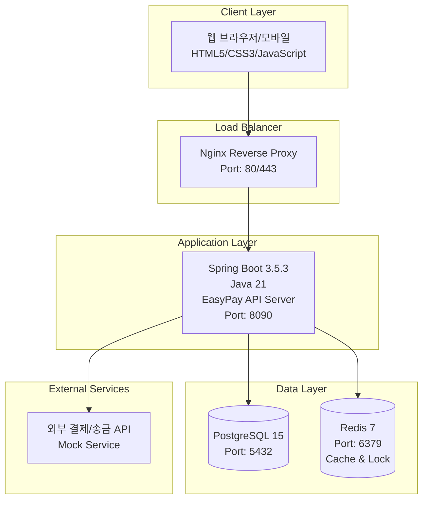
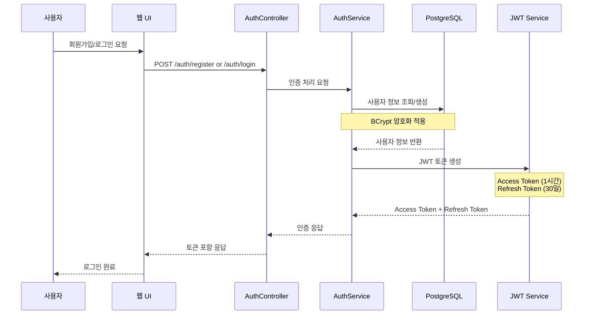
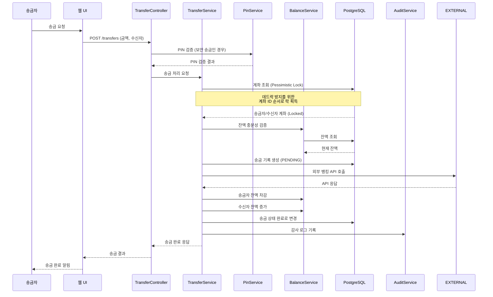
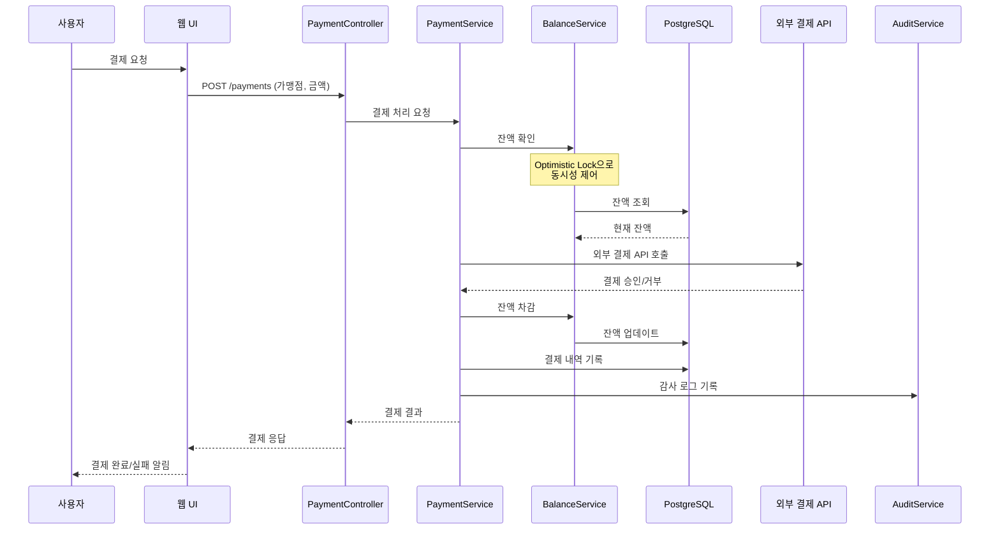
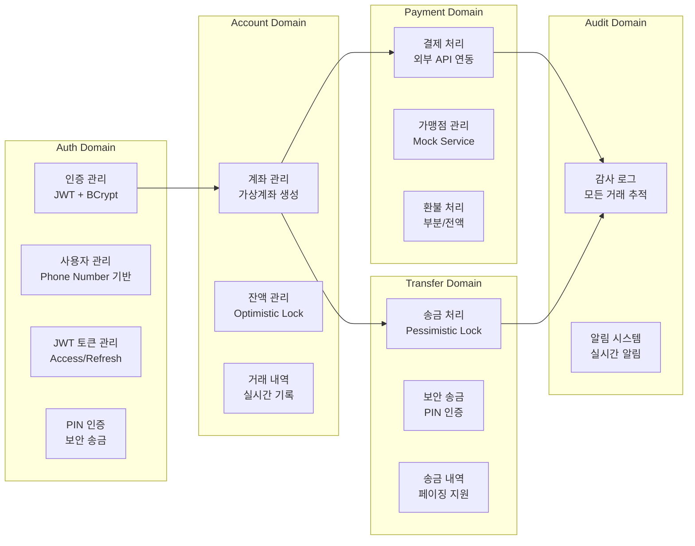
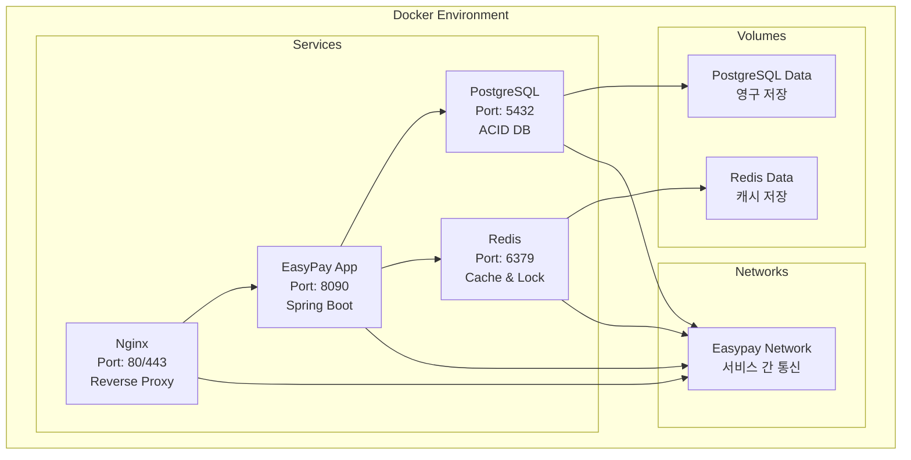
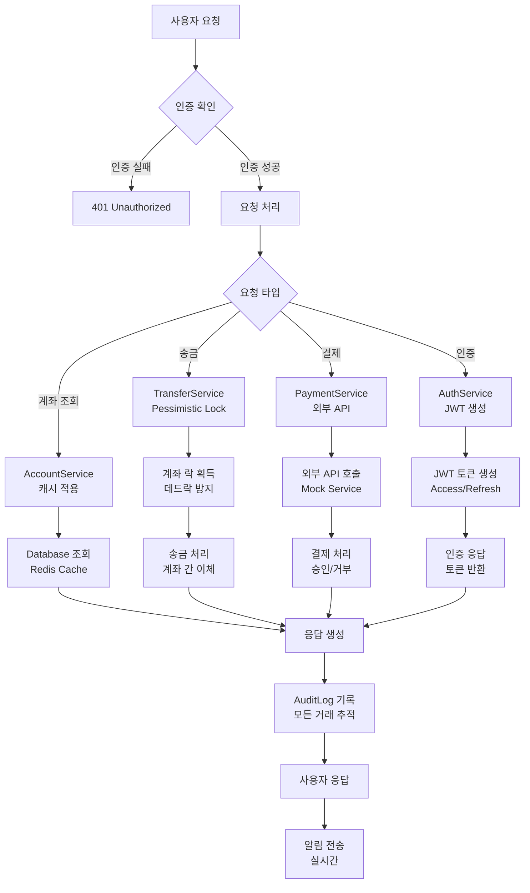

# EasyPay 핀테크 프로젝트 - 발표용 전체 구조

## 🏗️ 전체 시스템 아키텍처



## 🔄 핵심 비즈니스 흐름

### 1. 사용자 인증 흐름



### 2. 송금 처리 흐름 (Pessimistic Lock 적용)



### 3. 결제 처리 흐름



## 🏦 핵심 도메인 구조



## 🔐 보안 아키텍처

```mermaid
graph TB
    subgraph "Security Layer"
        JWT[JWT Authentication<br/>Stateless Token]
        SECURITY[Spring Security<br/>인증/인가]
        FILTER[JWT Filter<br/>요청 검증]
        ENCRYPTION[BCrypt Encryption<br/>비밀번호 해싱]
        LOCK1[Optimistic Lock<br/>@Version (잔액 관리)]
        LOCK2[Pessimistic Lock<br/>송금 동시성 제어]
    end
    
    subgraph "API Layer"
        CONTROLLER[Controllers<br/>REST API]
        SERVICE[Services<br/>비즈니스 로직]
        REPOSITORY[Repositories<br/>데이터 접근]
    end
    
    subgraph "Data Layer"
        DB[(PostgreSQL<br/>ACID 트랜잭션)]
        CACHE[(Redis Cache<br/>성능 최적화)]
    end
    
    JWT --> SECURITY
    SECURITY --> FILTER
    FILTER --> CONTROLLER
    CONTROLLER --> SERVICE
    SERVICE --> REPOSITORY
    REPOSITORY --> DB
    ENCRYPTION --> SERVICE
    LOCK1 --> SERVICE
    LOCK2 --> SERVICE
    CACHE --> SERVICE
```

## 🚀 배포 아키텍처



## 📊 주요 API 엔드포인트

```mermaid
graph LR
    subgraph "Authentication APIs"
        A1[POST /auth/register<br/>회원가입]
        A2[POST /auth/login<br/>로그인]
        A3[POST /auth/logout<br/>로그아웃]
        A4[GET /auth/profile<br/>프로필 조회]
        A5[POST /pin/verify<br/>PIN 검증]
    end
    
    subgraph "Account APIs"
        AC1[GET /accounts/balance<br/>잔액 조회]
        AC2[GET /accounts/history<br/>거래 내역]
        AC3[POST /accounts/deposit<br/>입금]
    end
    
    subgraph "Payment APIs"
        P1[POST /payments<br/>결제 처리]
        P2[GET /payments<br/>결제 내역]
        P3[POST /payments/{id}/cancel<br/>결제 취소]
        P4[POST /payments/{id}/refund<br/>환불]
    end
    
    subgraph "Transfer APIs"
        T1[POST /transfers<br/>일반 송금]
        T2[POST /transfers/secure<br/>보안 송금]
        T3[GET /transfers/history<br/>송금 내역]
        T4[GET /transfers/{id}<br/>송금 상세]
    end
    
    subgraph "Alarm APIs"
        AL1[GET /alarms/count<br/>알림 개수]
        AL2[GET /alarms/list<br/>알림 목록]
    end
```

## 🔄 데이터 흐름 (실제 구현된 Lock 방식)



## 🎯 주요 기능

### 1. 🔐 보안 시스템
- **JWT 기반 인증**: Access Token (1시간) + Refresh Token (30일)
- **BCrypt 암호화**: 비밀번호 안전한 해싱
- **PIN 인증**: 보안 송금 시 추가 인증
- **Optimistic Lock**: `@Version` 필드로 잔액 관리 동시성 제어
- **Pessimistic Lock**: 송금 시 계좌 동시성 제어
- **계정 잠금**: 5회 실패 시 30분 계정 잠금

### 2. 💰 가상계좌 시스템
- **자동 생성**: "VA" + 8자리 숫자 + 2자리 체크섬
- **잔액 관리**: Optimistic Lock으로 동시성 제어
- **거래 내역**: 모든 거래 실시간 기록 및 추적
- **잔액 검증**: 출금 시 잔액 부족 검증

### 3. 💸 송금 서비스
- **실시간 송금**: 계좌 간 즉시 이체
- **보안 송금**: PIN 인증을 통한 추가 보안
- **동시성 제어**: Pessimistic Lock으로 안전한 송금 처리
- **데드락 방지**: 계좌 ID 순서로 락 획득
- **외부 API 연동**: 뱅킹 API 호출

### 4. 💳 결제 시스템
- **외부 API 연동**: Mock 서비스로 결제 처리
- **환불 처리**: 부분/전액 환불 지원
- **결제 내역**: 페이징 처리된 거래 내역
- **실시간 처리**: 즉시 승인/거부

### 5. 🔔 알림 시스템
- **실시간 알림**: 잔액 변동, 로그인 성공/실패
- **카테고리별 필터링**: 전체/잔액/로그인/시스템
- **페이징 처리**: 10개씩 알림 목록
- **사용자/관리자 구분**: 거래내역 vs 시스템에러

### 6. 📊 감사 로깅
- **모든 거래 추적**: 송금, 결제, 로그인 등
- **실시간 기록**: 비즈니스 이벤트 즉시 저장
- **확장성**: SMTP, Slack 연동 준비 완료
- **보안 감사**: 모든 중요 이벤트 기록

## 🛠 기술 스택

### Backend
- **Framework**: Spring Boot 3.5.3
- **Language**: Java 21
- **Database**: PostgreSQL 15 (ACID 트랜잭션)
- **Cache**: Redis 7 (캐시 & 분산 락)
- **ORM**: JPA/Hibernate 6.6.18
- **Security**: Spring Security + JWT (JJWT 0.12.5)
- **Build Tool**: Gradle 8.x

### Frontend
- **HTML5/CSS3/JavaScript**: 반응형 웹
- **Bootstrap**: UI 프레임워크
- **JWT 토큰 기반 인증**

### DevOps
- **Docker**: 컨테이너화
- **Nginx**: 리버스 프록시
- **Gatling**: 성능 테스트

이 흐름도는 EasyPay 핀테크 프로젝트의 전체적인 구조와 데이터 흐름을 보여줍니다. **송금은 Pessimistic Lock**, **잔액 관리는 Optimistic Lock**을 사용하여 동시성 제어와 보안 시스템이 모든 거래에 적용되어 안전하고 확장 가능한 금융 서비스를 제공합니다.
